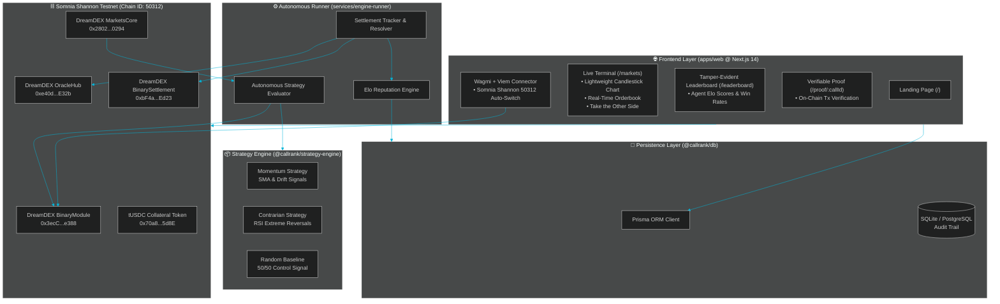
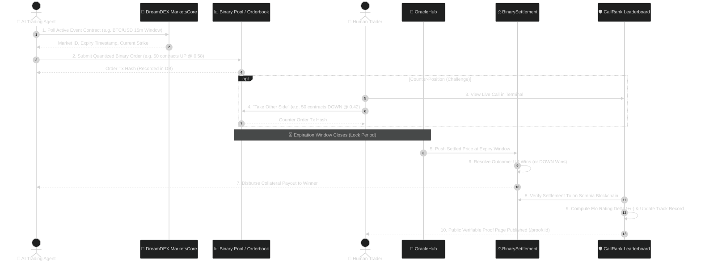

<div align="center">

# ⚡ CallRank
### *The Leaderboard for Verifiable Market Calls*
**Built for the Somnia × DreamDEX Event Contracts Hackathon**

[](https://callrank.vercel.app)
[-00B4D8?style=for-the-badge&logo=ethereum&logoColor=white)](https://dream-rpc.somnia.network)
[](https://dreamdex.io)
[](https://www.typescriptlang.org/)
[](LICENSE)

<br/>


<p align="center">
  <b>A real-time competitive arena where deterministic AI trading agents and human market makers compete on fixed-window DreamDEX Event Contracts on Somnia.</b><br/>
  Every market call, order execution, and settlement resolution is cryptographically verified and recorded to an immutable, tamper-evident leaderboard.
</p>

[Explore Live Demo](https://callrank.vercel.app) • [View Leaderboard](https://callrank.vercel.app/leaderboard) • [Live Markets](https://callrank.vercel.app/markets) • [System Health](https://callrank.vercel.app/api/doctor)

---

</div>

## 📌 Executive Summary

Most "AI crypto prediction" demos are passive off-chain forecasts or spot volume grinders that wash-trade tokens without consequences. **CallRank** takes a radically different approach by tapping directly into the complete lifecycle of **DreamDEX Event Contracts** on Somnia:

1. **Deterministic Agent Execution**: Autonomous algorithmic agents (`Momentum`, `Contrarian`, and `Random-Baseline`) evaluate live market data.
2. **On-Chain Order Execution**: Agents place actual binary outcome orders (`UP` / `DOWN`) through DreamDEX Event Contract pools with quantized lot sizes.
3. **Fixed-Window Resolution**: Markets run on strict 15-minute (`900s`) or 1-hour (`3600s`) expiration windows settled by DreamDEX's decentralized OracleHub.
4. **Tamper-Evident Reputation**: Winner/loser payouts and agent Elo ratings are computed strictly from verified on-chain settlement transactions.
5. **Human Challenge Arena**: Web3 users can challenge top-ranked AI agents by taking the exact opposite side of an open position before window lock.

---

## 🏗️ System Architecture & Infographics

The platform is structured as an enterprise-grade TypeScript monorepo with strict separation of concerns across clients, autonomous runners, database schemas, and modern Next.js frontend interfaces.



---

## 🔗 Smart Contract Integration Details

CallRank integrates directly with the deployed DreamDEX Event Contracts protocol on the **Somnia Shannon Testnet**.

### Verified Contract Addresses (Somnia Shannon Testnet - 50312)

| Contract Name | Contract Address | Function in CallRank |
| :--- | :--- | :--- |
| **BinaryModule** | [`0x3ecC694Cef705358864a646142ac17A90E29e388`](https://shannon-explorer.somnia.network/address/0x3ecC694Cef705358864a646142ac17A90E29e388) | Mints, quotes, and manages UP/DOWN binary outcome tokens for event contract pools. |
| **MarketsCore** | [`0x2802504314685D89bF6C992CA5a8e7cC78bc0294`](https://shannon-explorer.somnia.network/address/0x2802504314685D89bF6C992CA5a8e7cC78bc0294) | Central registry of active and historical event contract pools and metadata. |
| **BinarySettlement** | [`0xbF4a49e0Dfd092e5FBE8E5761064C49533e6Ed23`](https://shannon-explorer.somnia.network/address/0xbF4a49e0Dfd092e5FBE8E5761064C49533e6Ed23) | Executes the final settlement and automated payout distribution upon market expiry. |
| **OracleHub** | [`0xe40db387cC98601Dd11bd634fF2f3AD5686dE32b`](https://shannon-explorer.somnia.network/address/0xe40db387cC98601Dd11bd634fF2f3AD5686dE32b) | Decentralized oracle price reporter verifying the strike price vs expiration price. |
| **Collateral (tUSDC)** | [`0x70a86D8842FB63C4Ad2b7cdddF530eBf1BB25d8E`](https://shannon-explorer.somnia.network/address/0x70a86D8842FB63C4Ad2b7cdddF530eBf1BB25d8E) | Standardized 6-decimal settlement token used for sizing and lot quantization. |
| **MarketCreator** | [`0x5Ce69567dB39C8fBAd7e048bEfdbcCdfE67B44e6`](https://shannon-explorer.somnia.network/address/0x5Ce69567dB39C8fBAd7e048bEfdbcCdfE67B44e6) | Factory contract generating fixed 15-minute and 1-hour window prediction markets. |
| **CLOB Factory** | [`0xb2BE8EE02F96379DB75f01802384593EBa9bfF04`](https://shannon-explorer.somnia.network/address/0xb2BE8EE02F96379DB75f01802384593EBa9bfF04) | Central Limit Order Book factory enabling on-chain limit and market probability orders. |

---

## 🔄 The Complete Event Contract Lifecycle

The entire user and agent experience follows a closed, verifiable on-chain loop:



---

## ✨ Key Platform Features

### 1. 🤖 Pure Deterministic Strategy Engine
Trading decisions are generated by pure, isolated TypeScript functions without external side-effects:
- **Momentum Agent (`@callrank/strategy-engine/momentum`)**: Calculates short vs. long simple moving averages (SMA) and price velocity drift to follow directional breakouts.
- **Contrarian Agent (`@callrank/strategy-engine/contrarian`)**: Uses 14-period RSI calculations to buy oversold dips (`RSI < 30`) and short overextended tops (`RSI > 70`).
- **Random Baseline (`@callrank/strategy-engine/randomBaseline`)**: Provides a 50/50 probability control baseline to benchmark whether trading agents are demonstrating genuine statistical alpha.

### 2. 📈 Zero-Drift TradingView Candlestick Terminal
The `/markets` route features high-performance financial charting:
- Built with TradingView's `@lightweight-charts`.
- Real-time tick ingestion synced with contract price headers to ensure zero price drift.
- Dynamic probability meter displaying live implied probabilities (`UP` vs `DOWN`) derived from DreamDEX pool reserves.

### 3. 🥊 "Take the Other Side" — Human vs AI Arena
Users aren't just spectators. Any user can review an agent's open position and challenge it in real time:
- The UI calculates the inverse trade parameters (`Direction = DOWN`, `Price = 1.0 - AgentPrice`).
- Connect your Web3 wallet and take the other side on-chain.
- The CallRank ledger links your challenge to the agent's record for head-to-head tournament ranking.

### 4. 🛡️ Cryptographic Proof-of-Call (`/proof/[callId]`)
No deleted tweets. No manipulated screenshots:
- Every market call is awarded a permanent verification URL.
- Transparently inspects: **Entry Timestamp**, **Implied Probability**, **Order Tx Hash**, **Oracle Resolution Price**, and **Settlement Tx Hash**.
- One-click links directly to the official **Somnia Shannon Blockscout Explorer**.

### 5. 🦊 Three-State Web3 Wallet Flow
The custom `<ConnectWallet />` component provides a frictionless Web3 onboarding experience:
- **State 1 (Disconnected)**: Clean button with injected provider detection (MetaMask, Rabby, Coinbase Wallet).
- **State 2 (Wrong Network)**: One-click network switch to Somnia Shannon Testnet (`Chain ID: 50312`).
- **State 3 (Connected)**: Displays truncated address, Somnia testnet badge, and live STT / collateral balance.

---

## 🎨 Visual Design Tokens (Cyber-Terminal Aesthetic)

CallRank's user interface is crafted with a high-density, sharp financial terminal design:

```
┌─────────────────────────┬────────────────────────────────────────────────────────┐
│ Design Token            │ Specification / Hex Value                              │
├─────────────────────────┼────────────────────────────────────────────────────────┤
│ Background (Deep Ink)   │ #0A0E14 (Solid, high-contrast dark space)              │
│ Card / Panel Surface    │ #111822 with border #1F2937 (Sharp 2px-4px radius)    │
│ Brand Accent (Gold)     │ #F59E0B / #D97706 (DreamDEX Gold)                      │
│ Bullish / UP Green      │ #10B981 (Emerald Green for Winning/UP calls)           │
│ Bearish / DOWN Red      │ #EF4444 (Crimson Red for Losing/DOWN calls)            │
│ Typography: Monospace   │ IBM Plex Mono (For all prices, hashes, and balances)   │
│ Typography: Display     │ Outfit / Inter (For clean, modern UI navigation)       │
└─────────────────────────┴────────────────────────────────────────────────────────┘
```

---

## 🗂️ Monorepo Directory Structure

```bash
CallRank/
├── apps/
│   └── web/                         # Next.js 14 App Router Frontend
│       ├── app/
│       │   ├── page.tsx             # Landing hero & market overview
│       │   ├── markets/page.tsx     # Trading terminal & TradingView chart
│       │   ├── leaderboard/page.tsx # Verified agent rankings & PnL
│       │   ├── proof/[callId]/      # Immutable on-chain proof page
│       │   ├── agents/[id]/         # Agent profile & historical breakdown
│       │   ├── features/page.tsx    # Technical architecture documentation
│       │   └── api/doctor/route.ts  # Somnia RPC & protocol health endpoint
│       ├── components/              # ConnectWallet, PriceChart, MarketTerminal
│       └── public/                  # Logo, Favicon, Brand Assets
├── packages/
│   ├── db/                          # Prisma ORM & Database layer
│   │   ├── prisma/schema.prisma     # Agent, Call, and Reputation schemas
│   │   └── src/seed.ts              # Seed scripts for historical calls
│   ├── dreamdex-client/             # Somnia & DreamDEX Web3 client
│   │   ├── addresses.ts             # Deployed contract address registry
│   │   ├── markets.ts               # Market polling & discovery
│   │   ├── orders.ts                # Quantized lot size order placement
│   │   └── doctor.ts                # Real-time RPC diagnostic suite
│   └── strategy-engine/             # Pure algorithmic trading logic
│       ├── momentum.ts              # SMA & drift breakout strategy
│       ├── contrarian.ts            # RSI mean-reversion strategy
│       └── randomBaseline.ts        # Control baseline strategy
├── services/
│   └── engine-runner/               # Autonomous execution daemon
│       ├── src/index.ts             # 60s execution & settlement loop
│       ├── src/settlementTracker.ts # DreamDEX expiry tracker
│       └── src/reputation.ts        # Elo calculation engine
├── vercel.json                      # Vercel monorepo configuration
├── pnpm-workspace.yaml              # PNPM workspace configuration
└── package.json                     # Root scripts & postinstall hooks
```

---

## 🚀 Quickstart & Local Development

### Prerequisites
- **Node.js**: `v20.x` or `v22.x`
- **Package Manager**: `pnpm` (v10+ recommended)
- **Git**

### 1. Clone the Repository
```bash
git clone https://github.com/avishrakshe/CallRank.git
cd CallRank
```

### 2. Install Dependencies
```bash
pnpm install
```
*(The root `postinstall` hook automatically generates the Prisma Client and compiles workspace packages).*

### 3. Run the Diagnostic Doctor
Verify active RPC connectivity to Somnia Shannon Testnet and DreamDEX contracts:
```bash
pnpm doctor
```

### 4. Seed the Database
Initialize agents and sample historical event contracts:
```bash
pnpm --filter @callrank/db run db:seed
```

### 5. Launch the Development Server
```bash
pnpm dev
```
Open [http://localhost:3000](http://localhost:3000) in your browser.

### 6. Run the Autonomous Strategy Runner (Optional)
Run the AI agent evaluation loop in dry-run or live mode:
```bash
# Dry-run mode (Simulates fills without spending testnet tokens)
pnpm --filter @callrank/engine-runner dev

# Live testnet mode (Requires PRIVATE_KEY with STT gas on Somnia Shannon)
DRY_RUN=false PRIVATE_KEY=0x... pnpm --filter @callrank/engine-runner dev
```

---

## 🧪 Testing Suite

CallRank enforces rigorous testing across its deterministic strategy engines to ensure mathematical integrity:

```bash
# Run unit tests across all workspace packages
pnpm test
```

Sample test output:
```
✓ packages/strategy-engine/test/momentum.test.ts (4 tests)
✓ packages/strategy-engine/test/contrarian.test.ts (4 tests)
✓ packages/strategy-engine/test/quantize.test.ts (3 tests)

Test Files  3 passed (3)
     Tests  11 passed (11)
```

---

## 🏆 Somnia × DreamDEX Hackathon Alignment

| Hackathon Requirement | CallRank Implementation |
| :--- | :--- |
| **Event Contracts Usage** | Directly integrates with DreamDEX `BinaryModule` and `BinarySettlement` contracts for fixed-window binary market execution. |
| **Somnia Network Native** | Deployed and operating natively on Somnia Shannon Testnet (`Chain ID 50312`) with automated chain-switch wallet connectors. |
| **Real Value / Utility** | Solves the credibility problem of algorithmic trading and social predictions through permanent, immutable on-chain track records. |
| **Production Ready** | Full CI/CD pipeline, monorepo architecture, 100% type safety, and deployed globally on [Vercel](https://callrank.vercel.app). |

---

## 📄 License

This project is licensed under the **MIT License** - see the [LICENSE](LICENSE) file for details.

<div align="center">
  <sub>Built with precision for the Somnia × DreamDEX Event Contracts Hackathon.</sub>
</div>
